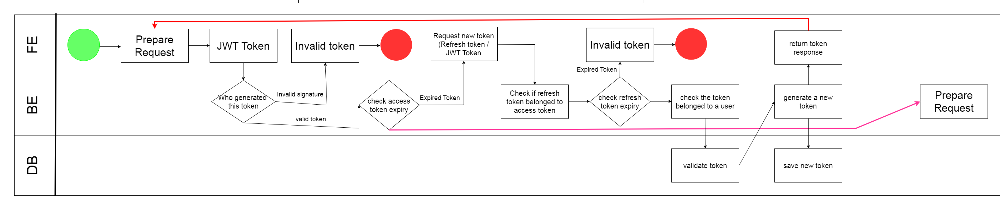
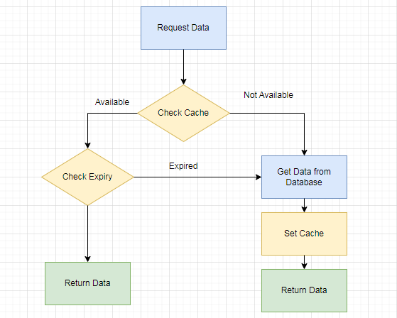

# Rest_API

# Version
- .NET SDK 7.0.400

# Nuget
- Microsoft.EntityFrameworkCore.Tools --version 6.0.3
- Pomelo.EntityFrameworkCore.MySql -version 7.0.0
- Microsoft.AspNetCore.Authentication.JwtBearer --version 7.0.0
- Microsoft.AspNetCore.Identity.EntityFrameworkCore --version 7.0.3
- Microsoft.AspNetCore.Identity.UI --version 7.0.0
- System.Runtime.Caching --version 8.0.0 (in-memory caching)
- AutoMapper.Extensions.Microsoft.DependencyInjection --version 12.0.1 (mapping)

# Functionalities
- Authentication & Authorization with JWT 
- Verify / Confirm Email with User Registration
    + Use Gmail SMTP
    + Add 2-Step Verification & App passwords (16-character) 
    + Send email with `email` and `App password` 

# Pipelines Authentication with Refresh Token

# In-Memory Caching

# AutoMapper & DTOs
